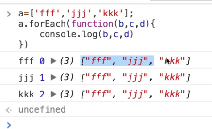

# 1，在Javascript中什么叫数组？
Array是 JavaScript 的原生对象，同时也是一个构造函数，可以用它生成新的数组。数组也是用Array构造出来的对象，拥有特有的原型；
`Array.__proto__ === Array.proto`，数组和对象的不同就是原型链。
加不加new没有什么区别。
```
var a = Array(3)
// 等价于
var a = new Array(3)
```
Array构造函数有一个很大的缺陷，就是不同的参数，会导致它的行为不一致。
```
var a = Array(3)
a.length // 3
```
这儿只是构造了一个长度为3，内容为undefined的数组。

而
```
var a = Array(3,3)
console.log(a)
//0: 3
  1: 3
  length: 2
```
## 2，数组常用API
* **forEach( )**
接受并执行同时传参给另一个函数，也是对数组的所有成员依次执行参数函数。但是，forEach方法不返回值，只用来操作数据。
```
var a = ['a','b','c']
a.forEach(function(value,key){
    console.log(value,key)
})
// a 0
   b 1
   c 2
```
a.forEach接受一个函数，这个函数必须接受三个参数。第一个参数是a的value，第二个参数是a的key，第三个参数是a它自己。


* **sort( )**
sort方法对数组成员进行排序，默认是按照字典顺序排序。排序后，原数组将被改变。
```
var a = [5,6,3,4,1,2]
a.sort(function(x,y){
    return x-y
})
//  [1,2,3,4,5,6]
```
如 x-y 返回的是负数，小的在前面，大的在后面。从小到大排列。返回是正数的话前的大，后面的小。从大到小排列。

* **join( )**
把数组里面的内容连起来。例：
```
a = [1,2,3]
a.join('加')
//"1加2加3"
```
若里面没有参数，则默认用（，）逗号连接。
```
a = [1,2,3]
a.join()
//"1,2,3"
```

* **concat( )**
把两个数组组成一个数组。
```
var a = [1,2,3]
var b = [4,5,6]
a.concat(b)
// [1,2,3,4,5,6]
```
* **reverse( )**
reverse方法用于颠倒排列数组元素，返回改变后的数组。注意，该方法将改变原数组。
```
var a = ['a', 'b', 'c'];
a.reverse() // ["c", "b", "a"]
a // ["c", "b", "a"]
```

* **map( )**
map方法将数组的所有成员依次传入参数函数，然后把每一次的执行结果组成一个新数组返回。
```
var a = [1,2,3];
a.map(function(value,key){
    return value*2
})
// [2,4,6]
```
简介代码
```
a.map(value => value*2)
// [2,4,6]
```

* **filter( )**
filter方法用于过滤数组成员，满足条件的成员组成一个新数组返回。它的参数是一个函数，所有数组成员依次执行该函数，返回结果为true的成员组成一个新数组返回。该方法不会改变原数组。
如将大于等于5的数组成员取出组成新数组：
```
a = [1,2,3,4,5,6,7,8,9,10]
a.filter(function(value,key){
    return value >= 5
})
// [5,6,7,8,9,10]
```
或者取偶数
```
a = [1,2,3,4,5,6,7,8,9,10]
a.filter(function(value,key){
    return value % 2 === 0
})
// [2,4,6,8,10]
```

* **reduce( )**
依次处理数组的每个成员，最终累计为一个值。
例如求和：一般我们是这样的利用for循环遍历a，然后求和：
```
var a = [1,2,3]
var sum = 0
for(let i=0; i<a.length; i++>){
    sum += a[i]
}
// 6   
```
但有了 reduce( ) 我们可以这样：
```
var a = [1,2,3]
a.reduce(function(sum,n){
    return sum + n
},0)
// 6
```
简介代码
```
a.reduce((sum.n)=> sum+n, 0)
// 6
```

map可以用reduce表示
```
a = [1,2,3]
a.reduce(function(arr,n){
    arr.push(n*2)
    return arr
},[])
// [2,4,6]
```

filter也可以用reduce表示
```
a = [1,2,3,4,5,6,7,8,9,10]
a.reduce(function(arr,n){
    if(n % 2 === 0){
        arr.push(n)
    }
    return arr
},[])
// [2,4,6,8,10]
```

计算所有奇数的和
```
var a = [1,2,3,4,5,6,7,8,9]
a.reduce((sum,n)=> {
    return n%2===1 ? sum + n : sum
} ,0)
// 25
```
