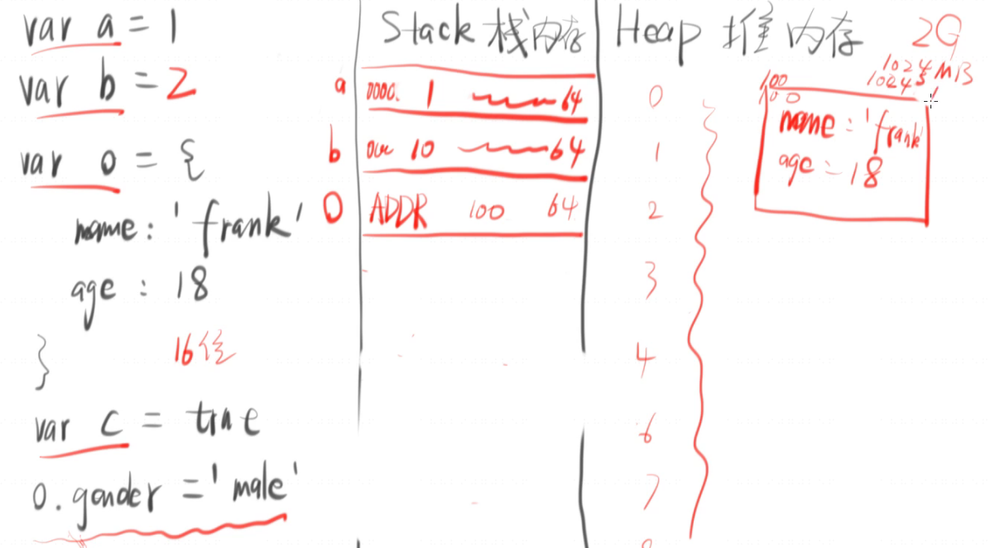
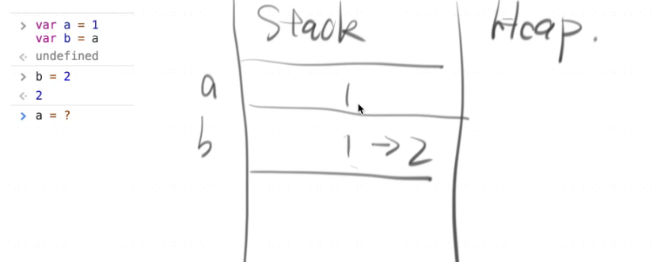
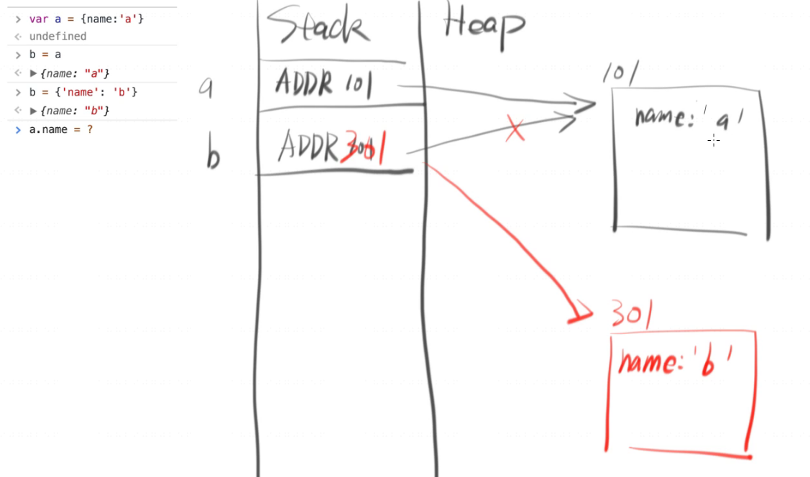
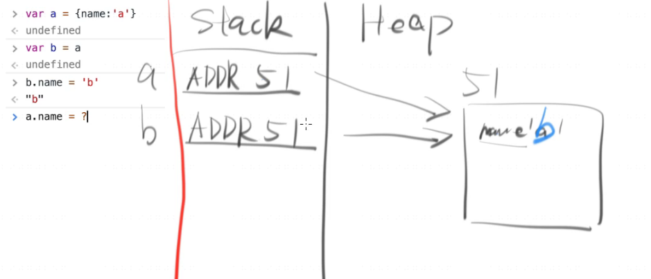
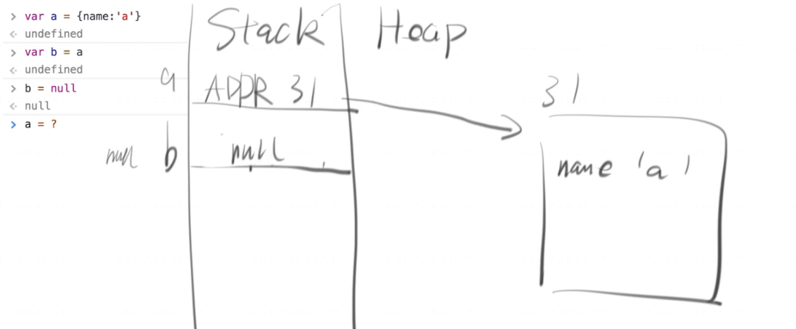
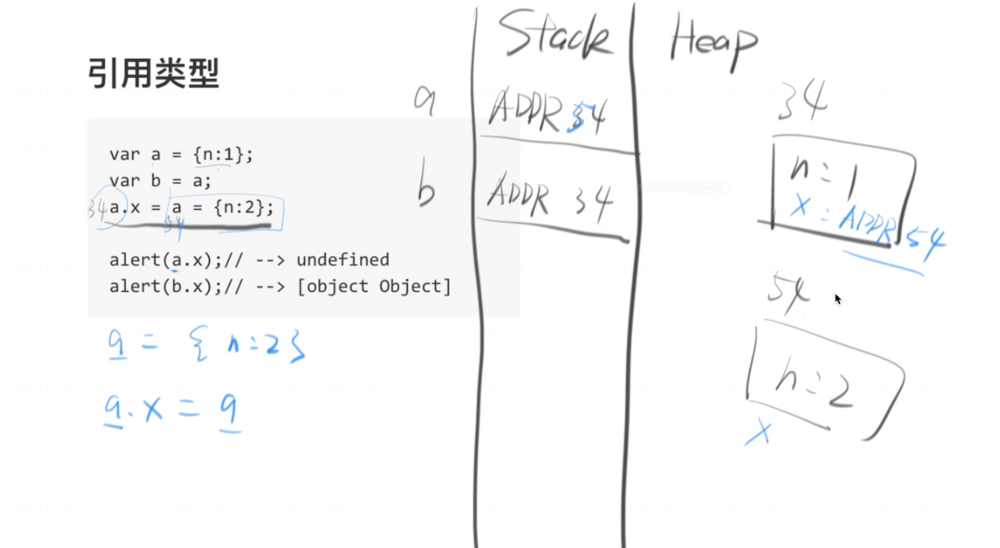
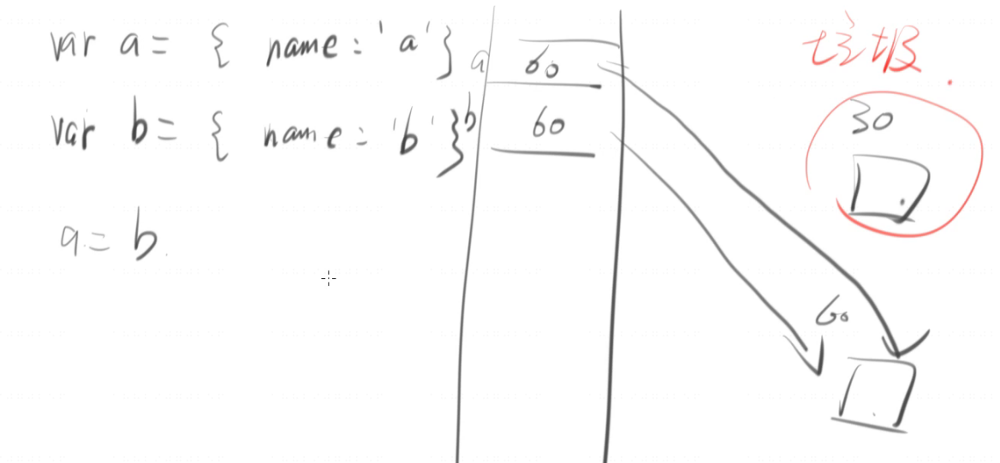

#### 一，任意类型转字符串（string）：有三种方法。
1，x.toString()（除了null,undefined) 这两种类型会报错！
```
(1).toString
//"1"

true.toString
//"true"

{}.toString
//"[object Object]"

1 + '1'
//"11"  因为会先把1转为字符串 (1).toString() + '1'  得到"11"
```

2，x + '' （任意类型，功能强大，老司机用法！）
```
1 + ''
//"1"

true + ''
//"true"

object + ''
//"[object Object]"

null + ''
//"null"

undefined + ''
//"undefined"
```

3，String(x)（全局函数）与第二种 x + ''相似
```
String(1)
//"1"

String(true)
//"true"

String(null)
//"null"

String(undefined)
//"undefined"

String({})
//"[object Object]"
```
#### 二，任意类型转布尔（Boolean）
1，Boolean(x)
```
Bollean(1)
//true

Boolean(0)
//false

Boolean('') 空字符串
//false

Boolean(' ') 空格
//true

Boolean(null)
//false

Boolean(undefined)
//false

Boolean({})
//true
```

2，！！x  （取反再取反）
```
!!1
//true

!!0
//false

!!''   空字符串
//false

!!'  '    空格
//true

!!null
//false

!!undefined
//false

!!{}
//true
```

转变为布尔时只有五个特殊值为false，分别是：" 0, NaN, '', null,  undefined"

#### 三，如何转为Number
比如把 '1' -> 1
1，Number('1')  ===1;
2，parseInt('1',10) ===1;
3，parentFloat('1.23')  ===1.23;
4，'1'-0   ===1;(适用任何也最常见)
5，+'1'   ===1;

##### parseInt基本用法：
parseInt方法用于将字符串转为整数
`arseInt('123') // 123`
如果字符串头部有空格，空格会被自动去除。
`parseInt('   81') // 81`
如果parseInt的参数不是字符串，则会先转为字符串再转换。
```
parseInt(1.23) // 1
// 等同于
parseInt('1.23') // 1
```
字符串转为整数的时候，是一个个字符依次转换，如果遇到不能转为数字的字符，就不再进行下去，返回已经转好的部分。
```
parseInt('8a')     // 8
parseInt('12**')   // 12
parseInt('12.34')  // 12
parseInt('15e2')   // 15
parseInt('15px')   // 15
```
如果字符串的第一个字符不能转化为数字（后面跟着数字的正负号除外），返回NaN。
```
parseInt('abc')    // NaN
parseInt('.3')     // NaN
parseInt('')       // NaN
parseInt('+')      // NaN
parseInt('+1')     // 1
```
所以，parseInt的返回值只有两种可能，要么是一个十进制整数，要么是NaN。

**进制转换：**
parseInt方法还可以接受第二个参数（2到36之间），表示被解析的值的进制，返回该值对应的十进制数。默认情况下，parseInt的第二个参数为10，即默认是十进制转十进制。
```
parseInt('1000')     // 1000
// 等同于
parseInt('1000', 10) // 1000
```
下面是转换指定进制的数的例子。
```
parseInt('1000', 2)     // 8
parseInt('1000', 6)     // 216
parseInt('1000', 8)     // 512
```
上面代码中，二进制、六进制、八进制的1000，分别等于十进制的8、216和512。这意味着，可以用parseInt方法进行进制的转换。
如果第二个参数不是数值，会被自动转为一个整数。这个整数只有在2到36之间，才能得到有意义的结果，超出这个范围，则返回NaN。如果第二个参数是0、undefined和null，则直接忽略。

**parseFloat**
parseFloat方法用于将一个字符串转为浮点数。
`parseFloat('3.14')     // 3.14`

如果字符串符合科学计数法，则会进行相应的转换。
```
parseFloat('314e-2')    // 3.14
parseFloat('0.0314E+2') // 3.14
```
如果字符串包含不能转为浮点数的字符，则不再进行往后转换，返回已经转好的部分。
`parseFloat('3.14more non-digit characters') // 3.14`

parseFloat方法会自动过滤字符串前导的空格。
`parseFloat('\t\v\r12.34\n ') // 12.34`

如果参数不是字符串，或者字符串的第一个字符不能转化为浮点数，则返回NaN。
```
parseFloat([])    // NaN
parseFloat('FF2') // NaN
parseFloat('')    // NaN
```
上面代码中，尤其值得注意，parseFloat会将空字符串转为NaN。

这些特点使得parseFloat的转换结果不同于Number函数。
```
parseFloat(true)  // NaN
Number(true)      // 1

parseFloat(null) // NaN
Number(null)     // 0

parseFloat('') // NaN
Number('')     // 0

parseFloat('123.45#') // 123.45
Number('123.45#') // NaN
```

#### 四，内存图
一般网页内存分为两块，一边存代码也叫做“代码区”，一边存数据“数据区”。
数据区又分两块，左边Stack（栈内存），右边Heap（堆内存）。
画内存图时，
把值（简单的数据类型）直接放在Stack里；
复杂型的如（object）把Heap ADDR存入Stack里。

object是通过一个地址来引用的，比如图中的100.

**四个关于内存的题目：**
1
```
var a = 1
var b = a
b = 2
a = ?  
//"1"
```
内存图


2
```
var a = {name: 'a'}
b = a
b = {'name':'b'}
a.name = ?
// "a"
```
内存图


3
```
var a ={name: 'a'}
var b = a
b.name = 'b'
a.name = ?
//"b"
```
内存图


4
```
var a ={name:'a'}
var b = a
b = null
a = ?
//{name: "a"}
```
内存图





**GC垃圾回收**：如果一个对象没有被引用，它就是垃圾，将会被回收。

此时的ADDR30就是name:'a'就变成了垃圾没用了。

#### 五，深拷贝与浅拷贝的概念
```
var a = 1
bar b = a 
b = 2
a = ？
//a = 1
```
上面代码表示b变不影响a，如果能实现这样的，简单类型除对象的赋值就叫做深拷贝！

```
var a = {name:'a'}
var b = a
b.name = 'b'
a.name ?
//a.name = 'b'
```
b变化导致a也跟着变化，这就叫做拷贝。


