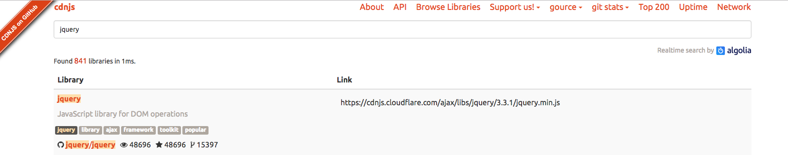

# 引入jQuery
jQuery 就是一个 JavaScript 库，封装了JavaScript，能够简化我们写代码的一个JavaScript库。
1、jQuery到本地引入（这种方法要求本地有jquery.js）
我们可以在[jQuery官网](http://jquery.com/download/)下载开发版本地引入：
```
<script src="jquery.js"></script>
<script> 
jQuery
</script>
```

官网这三个地址有的区别：
第一个用于实际的网站中，已被精简压缩；
第二个用于测试和开发，未压缩是可读 的代码；
第三个是jQuery映射文件。

2、通过cdnjs引入
在cdnjs上复制标签引入

在head标签中加入下列代码：
```
<script src="//cdnjs.cloudflare.com/ajax/libs/jquery/3.3.1/jquery.min.js"></script>
<script> 
jQuery
</script>
```

## 使用 jQuery
1、获取页面中 id 为 xxx 的元素
```
$('#xxx') 或 jQuery('#xxx')
```
2、div 和 $div 的联系和区别
```
<div id=x></div>

var div = document.getElementById('x')
var $div = $('#x')
```
div 和 \$div 的联系是：
\$(div) 可以将 div 封装成一个 jQuery 对象，就跟 \$div 一样
\$div[0] === div ，\$div 的第一项就是 div
div 和 \$div 的区别是：
div 的属性和方法有 childNodes firstChid nodeType 等
\$div 的 属性和方法有 addClass removeClass toggleClass等

### 实现一个 jQuery 的 API
例如：
```
// 可将所有 div 的 class 添加一个 red
// 可将所有 div 的 textContent 变为 hi
```
代码展示：
html
```

<!DOCTYPE html>
<html lang="zh-Hans">
<head>
  <meta charset="UTF-8">
  <meta name="viewport" content="width=device-width, initial-scale=1.0">
  <meta http-equiv="X-UA-Compatible" content="ie=edge">
  <title>Document</title>
  <link rel="stylesheet" href="./style.css">
</head>
<body>
  <div id='div'></div>
</body>
  <script src="https://cdnjs.cloudflare.com/ajax/libs/jquery/3.3.1/jquery.min.js"></script>
  <script src="./main.js"></script>
</html>
```
style.css
```
.red{
    color: red;
    text-align: center;
  }
```
main.js
```
var $div = $('div')

$div.setText = function(text){
  div.textContent = text
}

$div.addClass('red')
$div.setText('hi')
```
通过两个API “addClass('red')、setText('hi')”就可以实现。



