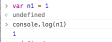
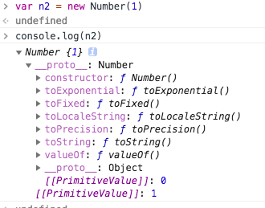

  全局对象
  在标准里面这个对象叫global，但在浏览器里我们称之为window。为浏览器的内置的功能为了让写js时去调用，比如：`global.parseInt`和`global.parseFloat`等。
  生成一个对象时首先先生成一个global存入一个地址就是window的地址，window里有parseInt,parseFloat等函数。
  window就是一个哈希表，有很多的属性。window的属性就是全局变量。
  这些全局变量分两种：
  第一种：ECMAScript规定的。
  如：global.parseInt，global.parseFloat，global.Number,global.String,global.Boolean,global.Object.等。
  第二种：浏览器私有的。比如几个与用户交互的函数，window.alret(弹框提示)，window.prompt(用户填写)，window.comfirm(用户确认),window.console.log()等等，还有最常见的window.document.createElement,window.document.getElementById.等。

简单类型与对象的区别
例如：`var n1 = 1`与`var n2 = new Number(1)`的区别：内存不同。
`var n1 = 1`就存了一个 1。


而`var n2 = new Number(1)`则是把 1 包装成了一个对象。里面有一些便捷的函数可供使用。



全局函数：Number，String，Boolean，Object。
前三种基本类型通过temp封装成复杂类型。例如：
```
var n = 1
n.toString()
//"1"
```
实际上是通过临时转换把简单类型转化为复杂类型或对象 
```
temp = new Number(n)
temp.toString()
```
然后把这个temp拿掉，通过这种转换来实现`n.toString()//"1"`。


**公用属性（原型）**：每一个对象都有一些相同的函数时，如果把他们都放在每一个对象里这样就很占内存，为了少占内存我们把它取出来放在同一个对象里，让其他的对象来共用它，这就是公用属性即 **原型（prototype）**。
然后我们用过__proto__：来调用这个公用属性。

所有对象的公用属性都是Object.prototype.
其次是Number有Number公用属性Number.prototype，String有String公用属性String.prototype，Boolean有Boolean公用属性Boolean.prototype。这三种最后都会指向Object.prototype，当然普通对象object的公用属性就直接指向Object.prototype。

比如我们在声明一个Number时，就不能指向这个公用函数，因为Number有他自己私有的prototype和__proto__:
```
Number.prototype
var n1 = new Number(1)
n1__proto__ = Number.prototype
n1__proto__.__proto__ = Object.prototype.（这就是我们讲的-所有对象的公用属性都是Object.prototype.）
```
Object.prototype对象也有__proto__，但它比较特殊，为null。
`Object.prototype.__proto__ === null`

**原型链**：简单理解就是原型组成的链，对象的__proto__是它的是原型，而原型也是一个对象，也有__proto__属性，原型的__proto__又是原型的原型，就这样可以一直通过__proto__向上找，这就是原型链，当向上找找到Object的原型的时候，这条原型链就算到头了。
`n1__proto__ = Number.prototype -->n1__proto__.__proto__= Object.prototype --> Object.prototype.__proto__ === null`

通过以上我们可以得出一个式子：“ var 对象 = new 函数 ”
那么： 对象.__proto === 对象构造的函数.prototype

// 推论
```
var number = new Number()
number.__proto__ = Number.prototype
Number.__proto__ = Function.prototype // 因为 Number 是 Function 的实例

var object = new Object()
object.__proto__ = Object.prototype
Object.__proto__ = Function.prototype // 因为 Object 是 Function 的实例

var function = new Function()
function.__proto__ = Function.prototype
Function.__proto__ == Function.prototye // 因为 Function 是 Function 的实例！
```

__proto__与prototye的区别：__proto__是对象的属性，prototy是函数的属性。


