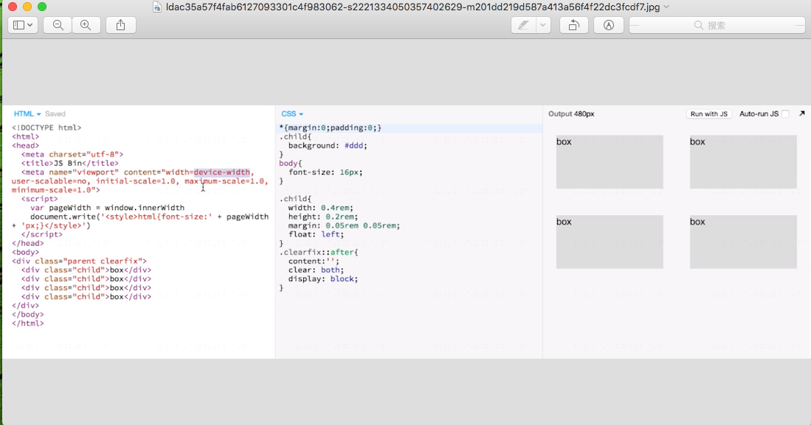

### 什么是 rem
  rem === root em即根元素的font-size，也就是html的font-size。
1rem=html的font-size大小。如果不对根元素的font-size的大小进行设置，那么一般html的font-size就是16px。即1rem===16px,
也可以自己设定根元素的font-size的大小。在css里写入`html{font-size: __px;};` 就可以根据需要自己设定1rem的具体大小了。

#### 做响应式页面时，一般有两种方法：
  1，使用百分比布局；
  2，就是对页面整体缩放（就会用到rem）。
    1，使用是百分比时，对页面里内容的宽度容易设置。但无法设置其高度。宽度与高度无法配合没有关联，因为宽度是按百分比布局的。无法确定其宽度。
如果给了页面宽度的值。那么就可以按百分比进行宽高设置定值。但没给具体数值的话就无法进行高度设置。
    2，使用整体缩放就引入的rem方案。（也可以使用vw，但使用vw的兼容性太差了）解决宽度和高度没有关联的问题。
  因为1rem=html的font-size，但html的font-size与页面宽度并没有关系。所以就想出了使用JS来设置html的font-size等于页面的宽度。
  1rem = html的font-size =(通过js来设置) pageWidth；然后1rem = 1pageWidth(页面宽度了)  就可以收那个rem为单位来设置页面里的内容的宽高了。
  借助于JS
```
<script>
    var pageWidth = window.innerWidth
	document.write('<style>html{font-size: ' + pageWidth + ' px;}</style>')
</script>
```

当使用rem为单位来设置页面宽高时，页面会随着在不同的宽度时进行缩放了。
如果是在手机上，那么一定要加上
```
<meta name="viewport" content="width=device-width, user-scalable=no, initial-scale=1.0, maximum-scale=1.0, minimum-scale=1.0">
```


来个小demo吧   [http://js.jirengu.com/zocolazopa/1/edit](http://js.jirengu.com/zocolazopa/1/edit)



另；
rem 可以与其他单位同时存在，例如：
```
font-size: 16px;
border: 1px solid red;
width: 0.5rem;
```

#### 在 SCSS 里使用 PX2REM
实现 px 自动变 rem
需使用命令行执行以下命令；
`npm config set registry https://registry.npm.taobao.org/`
`touch ~/.bashrc`
`echo 'export SASS_BINARY_SITE="https://npm.taobao.org/mirrors/node-sass"' >> ~/.bashrc`
`source ~/.bashrc`
`npm i -g node-sass`
`mkdir ~/Desktop/scss-demo`
`cd ~/Desktop/scss-demo`
`mkdir scss css`
`touch scss/style.scss`
`start scss/style.scss`
`node-sass -wr scss -o css`

编辑 scss 文件就会自动得到 css 文件

在 scss 文件里添加
```
@function px( $px ){
  @return $px/$designWidth*10 + rem;
}
```
$designWidth : 640; // 640 是设计稿的宽度，你要根据设计稿的宽度填写。

```
.child{
  width: px(320);
  height: px(160);
  margin: px(40) px(40);
  border: 1px solid red;
  float: left;
  font-size: 1.2em;
}
```
即可实现 px 自动变 rem